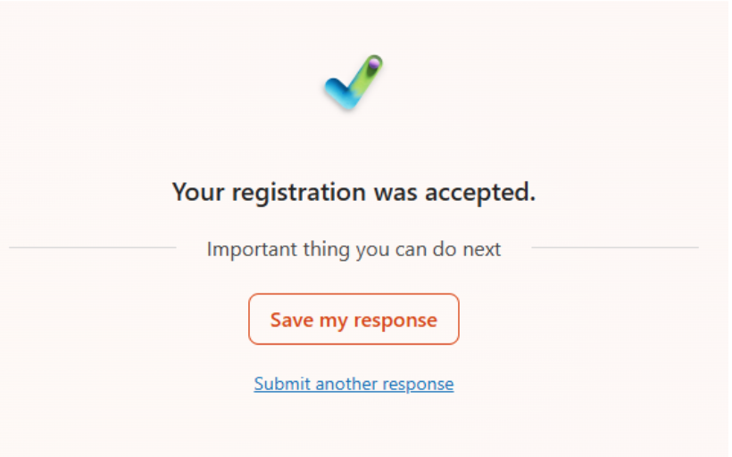

<a class="btn btn-primary btn" href="https://forms.office.com/e/XWMc4McidD">Register here!</a>

IICCSSS 2025 will take place in Darmstadt from 1st to 5th of September. Registration is open!

### Registration fees

Participation in the summer school is free of charge. However, in order to confirm your registration, you will be required to pay a deposit of €33, which you will get back at the start of the summer school. Reimbursement of the deposit is only possible in case of attendance. If you join the conference dinner on Wednesday, the deposit will be used to cover your dinner.

### Who can attend?

The event is targeted mainly at Bachelor's and Master's students in cognitive science, neuroscience, linguistics and related fields. We also welcome people further along on their academic journey, i.e., PhD candidates and postdocs.

### Travel grants

**UPDATE**: Application for travel grants is closed.

We give out a limited number of travel grants. Everyone who does not live in Darmstadt is eligible; however, priority will be given to participants traveling from abroad. If you would like to apply, please register before June 30th and complete the corresponding section in the registration form. 
<!-- We are still working on the details of the travel grant and will inform you once the exact conditions are finalized. We will almost certainly **not** be able to cover flights. In earlier iterations, we were able to offer 10 travel grants of €100 each and hope that it will be similar this year. If your attendance is contingent on receiving such a travel grant, and you’re unsure what to do, just sign up for now and let us know via mail. -->

### Accommodation in Darmstadt

We expect attendees to organize travel and accommodation on their own. We do not provide housing or food at the summer school (apart from some snacks and the conference dinner on Wednesday). Please find a hostel / hotel / airBnB in Darmstadt on your own. We will soon start connecting students from Darmstadt who indicated that they can host guests with attendees who still need accommodation.

<!--We have reserved 28 spots for the summer school participants in the hostel [Jugendherberge Osnabrück](https://www.jugendherberge.de/jugendherbergen/osnabrueck/). These are spots in shared bedrooms ranging from 2 to 6 beds that cost €42.70/night (this price includes breakfast).-->

<!--

    

        

        <iframe src="https://www.google.com/maps/embed?pb=!1m18!1m12!1m3!1d2442.4944404556327!2d8.06102297730017!3d52.25256587199224!2m3!1f0!2f0!3f0!3m2!1i1024!2i768!4f13.1!3m3!1m2!1s0x47b9ef8174b9583d%3A0x2e39d9c1e6e593d9!2sDJH%20Jugendherberge%20Osnabr%C3%BCck!5e0!3m2!1sen!2sde!4v1713014364718!5m2!1sen!2sde" width="600" height="450" style="border:0;" allowfullscreen="" loading="lazy" referrerpolicy="no-referrer-when-downgrade"></iframe>
                

    

-->
 

### Participant contributions: Lightning talks

Participation in the summer school does not only mean listening to the invited speakers, but also interacting with and learning from your peers! A great way to do this is to present a project you are working on as a lightning talk (≤15 min). It is not necessary to commit to giving a lightning talk during registration, but in the registration form we will ask you to indicate how likely you are to present. We will then contact you again ahead of the event, and ask you to provide the title and abstract of your talk.

# FAQ

### How do I know that my registration was successful?
If you clicked on *submit* and the following screen was shown, your registration was received. As soon as you pay the deposit, you have secured a spot. 

	

 

### When and how should I pay the deposit?
Please transfer the deposit by **July 15th** to secure your spot, otherwise we will have to give your spot to someone else on the waiting list.

**IBAN: DE20 8306 5408 0004 2587 62**

As the recipient, put "Computational Cognitive Science e.V." and most importantly, as a note put "Deposit " and your full name, e.g. “Deposit Hermoine Granger”.

Alternatively, you can PayPal us using the email info@iiccsss.org, and please put a note with "Deposit" + your full name, e.g. “Deposit Ronald Weasley”. 

### How will the dinner work?
If you choose to attend the conference dinner, we will use your deposit to pay for your meal. If you’d rather not attend the dinner, you will instead get your deposit back at the end of the summer school. Regarding menu options and dietary requirements, we will send out a form soon.

### Where should I show up Monday morning?
Registration will be open between 9:30 and 10:30 on Monday. There will be a welcome desk where you can get your name tag and everything else you need. Of course, you can still join the event a bit later if travel is difficult.

### Can I store my luggage somewhere?
You can store your luggage at the event location until the end of the event on Monday and on Friday.
